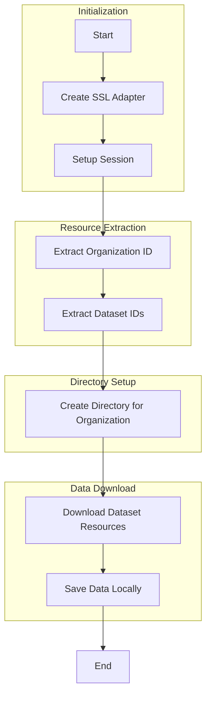

## Open Data - Kingdom of Saudi Arabia  
 
> This repository contains scripts to download datasets from the Open Data portal of the Kingdom of Saudi Arabia (KSA). The main script downloads all datasets for a given organization ID and saves them locally.  


### Directory Structure  

```{bash}
.
├── README.md
├── download_all_org.py
├── opendata (optional - parameter in file)
├── requirements.txt
├── src
│   ├── download_file.py
│   ├── get_dataset_resources.py
│   └── get_org_resources.py
└── system-drawing.excalidraw

```

### How It Works

1. **SSL Adapter**: A custom SSL adapter is created to handle HTTPS requests.
2. **Session Setup**: A session is created and the custom SSL adapter is mounted.
3. **Resource Extraction**: The organization ID and dataset IDs are extracted using the [`get_org_resources`](command:_github.copilot.openSymbolFromReferences?%5B%22%22%2C%5B%7B%22uri%22%3A%7B%22scheme%22%3A%22file%22%2C%22authority%22%3A%22%22%2C%22path%22%3A%22%2FUsers%2FEVA%2FDownloads%2FWCD%2Fexercises%2Fopen-data-ksa%2Fdownload_all_org.py%22%2C%22query%22%3A%22%22%2C%22fragment%22%3A%22%22%7D%2C%22pos%22%3A%7B%22line%22%3A17%2C%22character%22%3A16%7D%7D%5D%2C%2258b1143f-d36b-4590-bec8-13913091c2ea%22%5D "Go to definition") module.
4. **Directory Creation**: A directory named after the organization ID is created.
5. **Data Download**: All data resources for the organization are downloaded using the [`get_dataset_resources`](command:_github.copilot.openSymbolFromReferences?%5B%22%22%2C%5B%7B%22uri%22%3A%7B%22scheme%22%3A%22file%22%2C%22authority%22%3A%22%22%2C%22path%22%3A%22%2FUsers%2FEVA%2FDownloads%2FWCD%2Fexercises%2Fopen-data-ksa%2Fdownload_all_org.py%22%2C%22query%22%3A%22%22%2C%22fragment%22%3A%22%22%7D%2C%22pos%22%3A%7B%22line%22%3A17%2C%22character%22%3A35%7D%7D%5D%2C%2258b1143f-d36b-4590-bec8-13913091c2ea%22%5D "Go to definition") module.

### Process Flow



### Usage 

To run the script with the dependencies, first install the `virtualenv`:

```bash

python -m venv venv

pip install -r requirements.txt

```


Then you'll be able to run the python primary python script successfully:

```bash
python download_all_org.py
```

NOTE: For a different organization, you need to update the parameter in the file for the `org_id` parameter in the function


### Release Plan / To DO

- [ ] Create a set of functions to cover the entire API, including:
    - [ ] Create a function to get the list of organizations
    - [ ] Create a function to get the list of datasets for an organization
    - [ ] Create a function to get the list of resources for a dataset
    - [ ] Create a function to download a resource
    - [ ] Create a function to check the status of a download
- [ ] Create a set of unit tests for the functions
- [ ] Create a set of integration tests for the functions
- [ ] Create a set of examples for the functions
- [ ] Create a set of documentation for the functions
- [ ] Move the repository to a PyPi library

### Contribution

The contribution process is as follows:

1. Clone the repository and create a new branch
2. Make your changes, following the coding style guidelines
3. Create a pull request with a detailed description of your changes
4. Wait for your pull request to be reviewed and approved
5. Once approved, your changes will be merged and available in the main branch

When contributing to this repository, please first discuss the change you wish to make via issue,
email, or any other method with the owners of this repository before making a change.

Please note we have a code of conduct, please follow it in all your interactions with the project.